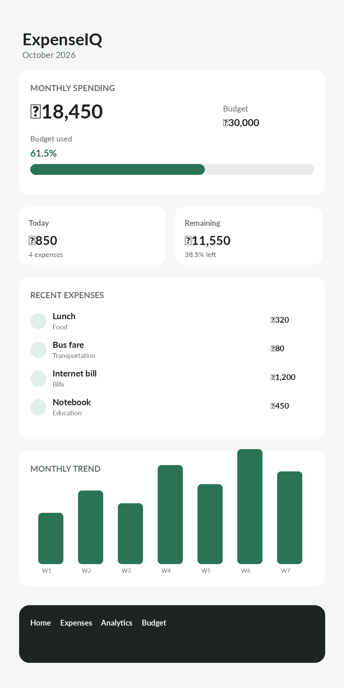
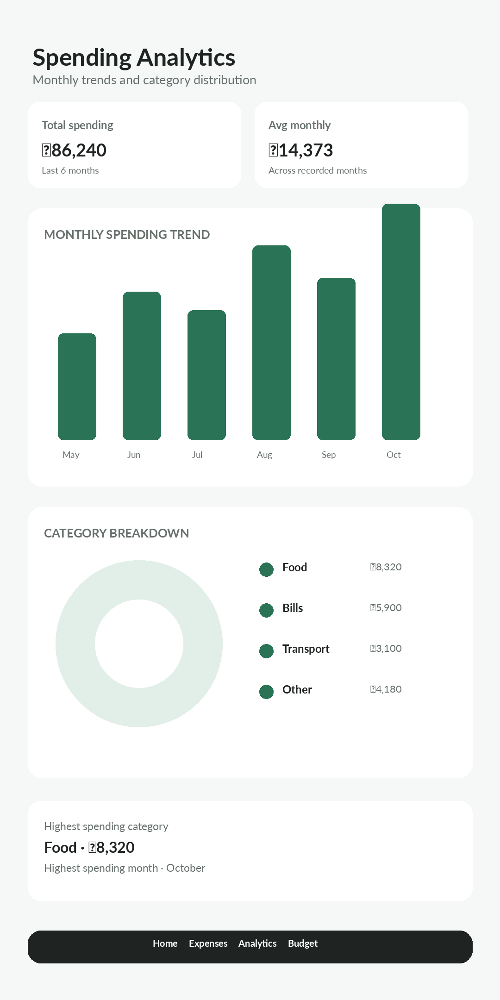
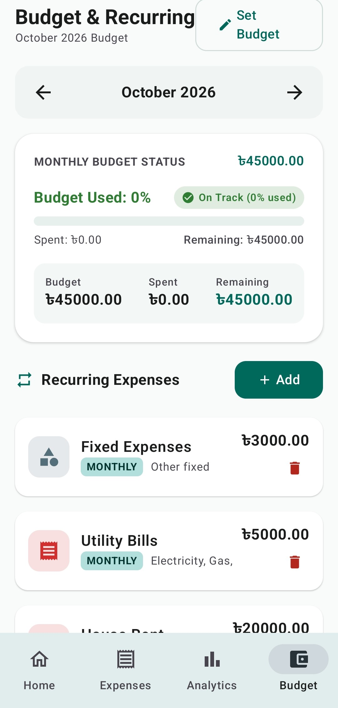

# ExpenseIQ

ExpenseIQ is a local-first Android expense tracker designed for simple everyday money management. It keeps expenses, budgets and recurring costs organized on the device while giving the user a clear view of monthly spending and longer-term trends.

The project focuses on a practical mobile experience rather than a complicated finance platform. It supports English and Bangla and uses Bangladeshi Taka as the default currency.

## Preview

### Dashboard



### Spending analytics



### First-time financial setup



> The images above are repository UI previews based on the current screens and sample data. They contain no real personal financial information.

## What it can do

- Account registration and sign-in
- Persistent login session
- First-time monthly financial setup
- English and Bangla interface
- Bangladeshi Taka (৳) support plus additional currency symbols
- Add, edit and delete expenses
- Expense categories and notes
- Recurring expenses for weekly, monthly and yearly items
- Monthly budget tracking
- Budget progress and spending warnings
- Expense search and category/date filtering
- Monthly and yearly spending analytics
- Category-wise spending breakdown
- Monthly trend comparison
- Light, dark and system themes
- Confirmation before deleting an expense
- Local storage with Room database

## Why it is local-first

ExpenseIQ stores its application data in a Room database on the Android device. There is no application server, cloud database or third-party account system in this repository.

This keeps the core tracker usable without a network connection and limits the amount of personal financial information that leaves the device.

## Tech stack

| Area | Technology |
| --- | --- |
| Language | Kotlin |
| UI | Jetpack Compose + Material 3 |
| Architecture | ViewModel + Repository pattern |
| Local database | Room |
| State | Kotlin Coroutines + StateFlow |
| Navigation | Navigation Compose |
| Charts | Custom Compose chart components |
| Build | Gradle Kotlin DSL |
| Minimum Android | API 24 |
| Target Android | API 36 |

## Project structure

```text
app/src/main/java/com/expenseiq/app/
├── data/
│   ├── local/          # Room database and DAOs
│   ├── model/          # Expense, budget, user and recurring models
│   └── repository/     # Data access and application rules
├── security/           # Password hashing and encrypted session storage
└── ui/
    ├── components/     # Reusable Compose components and charts
    ├── screens/        # Application screens
    ├── theme/          # Material theme configuration
    ├── util/           # Localization helpers
    └── viewmodel/      # UI state and business flow
```

## Data model

The main local entities are:

- `User` - account information, language, currency and monthly allowance
- `Expense` - individual spending records
- `Budget` - monthly budget values
- `RecurringExpense` - fixed or repeating obligations

Monthly budgets are stored by year and month. Expense queries use the same month boundaries so analytics can compare recorded periods over time.

## First-time setup

After registration the app asks for a basic monthly financial baseline:

1. Monthly allowance or income
2. Rent
3. Monthly bills
4. Other fixed monthly expenses
5. Monthly spending budget
6. Preferred language and currency

The current month budget is saved locally and fixed obligations can be represented as recurring expenses.

## Getting started

### Requirements

- Android Studio
- Android SDK with API 36 installed
- JDK 17 or the JDK version required by the installed Android Studio and Android Gradle Plugin
- An Android emulator or physical Android device

### Run

1. Clone the repository.
2. Open the project in Android Studio.
3. Let Android Studio sync the Gradle project.
4. Select an emulator or connected Android device.
5. Run the `app` configuration.

No API key is required for the current local-first application.

## Testing

The project includes unit and Android instrumentation test modules. Run them from Android Studio or use the Gradle test actions provided by the IDE.

Before publishing a build, verify at minimum:

- Registration and sign-in
- Sign-out and session restoration
- First-time financial setup
- Expense create/edit/delete flows
- Budget calculations and warning thresholds
- Recurring expense operations
- Monthly and yearly analytics
- Language switching
- Currency selection
- Light/dark/system themes
- Data isolation between local user records

## GitHub safety checklist

Before pushing changes, check that the repository does not contain:

- `.env` files
- API keys
- Cloud service credentials
- Signing keystores
- Passwords or tokens
- Local IDE state
- Generated build output

A quick local check can be done with your IDE search for terms such as `API_KEY`, `SECRET`, `TOKEN`, `PASSWORD` and provider-specific credential names. Review every match before publishing.

## Design decisions

### Local storage instead of a server

The core use case does not require a backend. Room provides reliable structured storage while keeping the application usable offline.

### Repository-based data access

Screens do not talk directly to the database. Repositories sit between the UI state and Room DAOs which keeps the application easier to test and maintain.

### Device-backed session protection

The session identifier is encrypted before it is written to preferences. The encryption key is generated and protected by Android Keystore rather than being placed in source code.

### Simple financial model

ExpenseIQ separates one-time expenses, monthly budgets and recurring obligations. This keeps calculations understandable while still supporting useful monthly comparisons.

## Current limitations

- Data is stored locally on the Android device and is not synchronized between devices.
- There is no account recovery service because accounts are local to the device.
- Cloud backup is intentionally not enabled by the application.
- The project currently targets Android rather than iOS.

## Future improvements

- Optional encrypted export and import for user-controlled backups
- More detailed monthly financial history
- Better recurring-expense scheduling
- Automated database migrations for future schema versions
- Additional accessibility refinements
- Optional cloud synchronization with explicit user consent

## License

Add the license you want to use before publishing the repository publicly. Until then, the source should be treated as all-rights-reserved by the repository owner.
